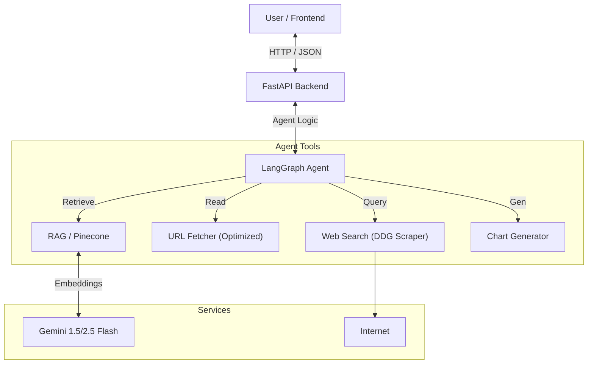

# Capstone Project: Intelligent AI Agent

## Overview
This project is a sophisticated **full-stack AI Agent** built to demonstrate advanced capabilities like Retrieval-Augmented Generation (RAG), real-time data visualization, autonomous web research, and voice interaction.

It uses a **Hybrid Architecture**:
- **Backend**: Python (FastAPI) + LangGraph (Agentic Logic) + Google Gemini (LLM) + Pinecone (Vector DB).
- **Frontend**: React + Vite (Modern UI) + Framer Motion (Animations).

## 🚀 Quick Start

### 1. Prerequisites
- Python 3.10+
- Node.js 18+
- **Audio Drivers**: For Voice Input, ensure your microphone is active.

### 2. Environment Setup
Create a `.env` file in the root directory:
```env
# Required for LLM
GEMINI_API_KEY=AIzaSy...

# Required for RAG
PINECONE_API_KEY=pcsk_...
PINECONE_ENV=us-east-1

# Optional but recommended
OPENAI_API_KEY=sk-... (If using OpenAI embeddings)
```

### 3. Installation
**Backend**:
```bash
pip install -r backend/requirements.txt
# Special Step for Voice:
pip install SpeechRecognition pyaudio
# (Windows users: if pyaudio fails, try 'pip install pipwin && pipwin install pyaudio')
```

**Frontend**:
```bash
cd frontend
npm install
```

### 4. Run the Application
Simply double-click **`run_app.bat`** in the root directory.

Or run manually:
- **Backend**: `uvicorn backend.main:app --port 8000 --reload`
- **Frontend**: `npm run dev` (Access at http://localhost:5173)

---

## ✨ Key Features & Implementation Details

### 1. 📂 Document RAG (Knowledge Base)
- **Functionality**: Upload PDF/DOCX files via the Sidebar. The system chunks, embeds, and stores them in Pinecone.
- **Usage**: Ask "What does the uploaded document say about [Topic]?".
- **Tech**: `LangChain`, `Pinecone`, `RecursiveCharacterTextSplitter`.

### 2. 📊 Dynamic Data Visualization
- **Functionality**: The AI can generate Line, Bar, and Pie charts on demand.
- **Robustness**: Even if the AI chats about the data ("Here is your chart..."), the backend **automatically extracts the hidden JSON** and forces the frontend to render the graphic.
- **Usage**: "Show me a line chart of Apple's revenue for the last 4 quarters."

### 3. 🌐 Autonomous Web Research
- **Functionality**: Real-time web searching without relying on broken libraries.
- **Implementation**: Uses a custom **Manual HTML Scraper** for DuckDuckGo to bypass API versioning issues.
- **Usage**: "Search for the latest trends in AI."

### 4. 🔗 Smart URL Fetcher
- **Functionality**: Reads content from specific URLs.
- **Optimization**: Includes **Browser Headers** (User-Agent) to bypass bot protection and **Content Truncation** (5000 chars) to prevent Gemini API "Quota Exceeded" errors.
- **Usage**: "Read this article: https://example.com/article"

### 5. 🎙️ Real-time Voice Input (Server-Side)
- **Functionality**: Speak to the agent using your microphone.
- **Architecture**:
    - **Old way**: Browser Web Speech API (unreliable).
    - **New way**: Audio is captured by the **Backend** (`SpeechRecognition` library) for higher accuracy and stability.
- **Usage**: Click the Mic icon -> Speak -> Watch text appear.

---

## 🏗️ Architecture



## ❓ Troubleshooting

### "Quota Exceeded (429)"
- **Cause**: The Free Tier of Gemini API has limits (RPM/TPM). Reading huge URLs or lengthy RAG contexts can hit this.
- **Fix**: Wait 60 seconds. The system includes optimization (truncation) to minimize this.

### "Voice Input Error"
- **Cause**: Missing `pyaudio` or `SpeechRecognition` library on the server.
- **Fix**: Run `pip install SpeechRecognition pyaudio`. On Windows, check microphone permissions.

### "Chart not showing"
- **Cause**: AI returned text instead of JSON.
- **Fix**: Fixed in backend v2.0. The system now parses mixed content automatically.
